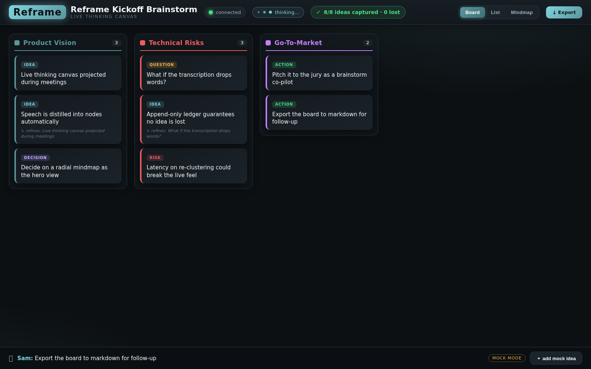
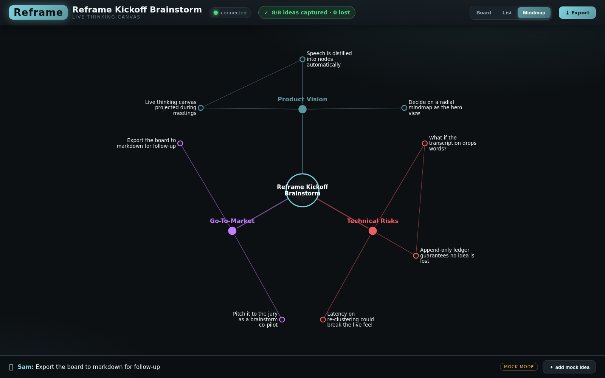
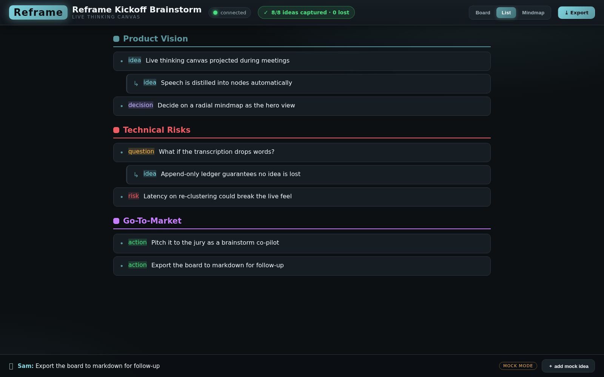

# Workshop Results

A record of everything built and configured in this repo for the **perception-agents
workshop**: the main challenge (annotate → fix → verify pipeline) plus the contest entry,
**Reframe — a live thinking canvas**.

> Reference docs: [WORKSHOP.md](WORKSHOP.md) · [EASY path](WORKSHOP-EASY.md) ·
> [MEDIUM path](WORKSHOP-MEDIUM.md)

---

## 1. Main challenge — annotate → fix → verify pipeline ✅

Wired the Chrome annotator extension to the local agent bridge so a single **"Apply changes"**
button runs the whole loop: annotations → AI CLI edits the source → dev server hot-reloads →
Nova Act verification → report.

| Change | File | What |
|---|---|---|
| `host_permissions` for `http://localhost:*/*` | [`tools/extension/manifest.json`](tools/extension/manifest.json) | lets the content script `fetch()` the bridge cross-origin (MV3) |
| "Apply changes" button + status polling | [`tools/extension/content.js`](tools/extension/content.js) | POSTs annotations to `/api/apply`, polls `/api/apply/status`, shows View Report / Reset |
| Spinner animation | [`tools/extension/content.css`](tools/extension/content.css) | hourglass spin during apply/verify |

The bridge itself ([`tools/agent-bridge/agent-bridge.js`](tools/agent-bridge/agent-bridge.js))
and the verification script
([`tools/agent-bridge/verify-with-nova-act.py`](tools/agent-bridge/verify-with-nova-act.py))
ship with the repo. Pre-generated specs (`some-podcast-app/.ui-verification/specs/`) and the
design source of truth (`some-podcast-app/visual/design.md`) are present, so verification skips
the cold start.

**Run it:**
```bash
node tools/agent-bridge/agent-bridge.js --port 9999 --feedback .tmp/feedback.json \
  --app-dir some-podcast-app --cli claude
# then: load tools/extension in chrome://extensions, annotate localhost:5173, click "Apply changes"
```

## 2. Environment setup ✅

| Item | Status | Notes |
|---|---|---|
| `uv` virtualenv (`.venv`, Python 3.12) | ✅ | created with uv |
| Python deps (nova-act, playwright, flask, pillow, click) | ✅ | `uv pip install -r tools/agent-bridge/requirements.txt` |
| Consolidated dependency manifest | ✅ | [`pyproject.toml`](pyproject.toml) |
| Node deps (agent-bridge `marked`, podcast app) | ✅ | `npm install` |
| Playwright browsers | ✅ | already cached locally |
| Nova Act MCP server config | ✅ | [`.mcp.json`](.mcp.json) — `nova-act-mcp` + `--toolsets ui-verification` + API key (gitignored; loads on next Claude Code restart) |

**Manual steps left to the user** (blocked in auto mode / interactive):
```bash
# Perception skills (interactive prompts: pick both skills, your agent, Project scope, Symlink, Y)
npx skills@latest add amazon-agi-labs/nova-act-agent-skills

# Nova Act key for the official verification path (agent-bridge → verify-with-nova-act.py)
export NOVA_ACT_API_KEY="<your-nova-act-api-key>"
```

## 3. Contest entry — Reframe, a live thinking canvas 🏆

The bonus challenge asks for a creative composition of the two perception primitives. **Reframe**
goes further: it reframes them for a brand-new use case — turning live conversation into a
self-organizing visual canvas.

> **Talk. The canvas rebuilds itself. Nothing is ever lost.**
> Say *"show this as a mindmap"* → **Reframe**, the view morphs.

You talk near a [Bee](https://bee.computer/) wearable; spoken ideas are distilled into nodes,
auto-clustered into themes, and rendered live on a projected canvas — board, list, or mindmap.
The model is **append-only**, so a coverage badge can prove **"N/N ideas captured · 0 lost"**.

| Workshop primitive | Reframe reframing |
|---|---|
| **Annotation** (perception of DOM clicks) | Perception of **speech** via Bee |
| **Verification** (CSS rule vs expected value) | **Coverage** check — every utterance maps to a node (0 lost) |

| Board | Mindmap | List |
|---|---|---|
|  |  |  |

**Docs:** [Reframe README](tools/reframe/README.md) · [Architecture](tools/reframe/ARCHITECTURE.md) ·
[Contract](tools/reframe/CONTRACT.md)

**Run it:**
```bash
node tools/reframe/reframe-server.js --port 9998 --state tools/reframe/.tmp/board.json   # serves UI + SSE
node tools/reframe/replay.js --port 9998                                          # rehearse a session
# open http://localhost:9998  — or talk near your Bee for live input
```

### What was verified
- Full pipeline through the real `claude` brain: utterances → distilled nodes → multi-theme
  clusters; view commands ("show as mindmap") morph the view.
- Live frontend↔backend over SSE (board renders 12 nodes, coverage **12/12 · 0 lost**, markdown
  export) — see [`tools/reframe/screenshots/`](tools/reframe/screenshots/).
- All three views render with **0 console errors**; never-lose fallback keeps an idea even if the
  model fails.

### Still to do for a live Bee demo
```bash
npm install -g @beeai/cli
bee login        # YOUR Bee account (so your device's conversations stream in)
bee status
```

---

## Repository map

```
tools/
├── extension/            ← Chrome annotator (Apply-changes button wired in)
├── agent-bridge/         ← HTTP bridge + Nova Act verification script
├── bee-annotator-solution/ ← reference Bee→fix→verify proxy (workshop Option 1)
└── reframe/                  ← Reframe live thinking canvas (contest entry)
some-podcast-app/         ← sample app + pre-generated verification specs
.mcp.json                 ← Nova Act MCP server (gitignored)
pyproject.toml            ← consolidated Python deps
```
